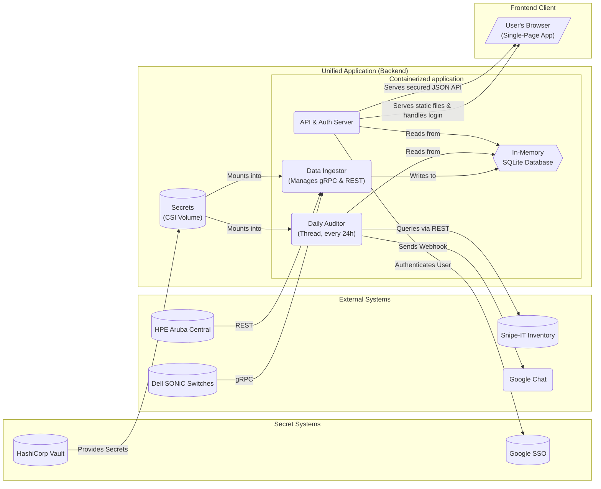

# Project: Network Inventory and Monitoring

## Table of Contents

- [Background and Motivation](#background-and-motivation)
- [System Architecture Diagram](#system-architecture-diagram)
- [Key Challenges and Analysis](#key-challenges-and-analysis)
- [High-level Task Breakdown](#high-level-task-breakdown)
- [Project Status Board](#project-status-board)
- [Current Status / Progress Tracking](#current-status--progress-tracking)
- [Executor's Feedback or Assistance Requests](#executors-feedback-or-assistance-requests)
- [Lessons](#lessons)
- [Technology Stack](#technology-stack)

## Background and Motivation

The project will be delivered as a single, unified application built with an **API-first** design and robust security. Its functions are:

1. **Backend Service**: A backend service will manage all core logic. It runs two background processes: one continuously ingests live network data (via gRPC for SONiC and a REST API for Aruba), and another performs a daily audit against the Snipe-IT inventory (via REST API). The service retrieves all its necessary credentials from files mounted into the container, which are provided by **HashiCorp Vault** via the Kubernetes CSI driver.
1. **Frontend Web UI**: A modern, single-page web application (SPA) will act as the primary user interface, with access secured by **Google SSO**. It is a pure client that consumes the backend's REST API to display both the live network view and the daily audit reports.

This unified, API-first architecture simplifies deployment, centralizes authentication, and creates a flexible system where the frontend can be updated independently of the backend.

The backend service will be implemented in **Go 1.22**, compiled as a static binary to keep the container image minimal and portable.

## System Architecture Diagram



## Key Challenges and Analysis

1. **Frontend Authentication (Google SSO)**: The backend API server must act as an OAuth2/OIDC client. It will need to handle the redirect flow, validate tokens from Google, and manage user sessions to protect both the frontend and the API endpoints.

1. **Mandatory Authentication Policy**: **CRITICAL SECURITY REQUIREMENT** - No user can access the web UI or any part of the API without valid Google OAuth authentication. All endpoints (including static file serving, health checks accessible to users, and API endpoints) must enforce this authentication requirement. There should be no anonymous access paths or bypass mechanisms except for the OAuth callback endpoint itself.

1. **Backend Secret Management**: The application will rely on the Kubernetes Secrets Store CSI driver to mount secrets from HashiCorp Vault as files, avoiding the need for a native Vault client.

   **Service Account**: `network-audit-service`

   **Vault Authentication Token**: `/var/run/secrets/kubernetes.io/serviceaccount/token`

   - This is the Kubernetes service account token automatically mounted in the pod
   - Used by the CSI driver to authenticate against HashiCorp Vault
   - The token authenticates the `network-audit-service` service account

   **Primary Secret Path**: `/v1/kv/data/k8s/v1/devit-prod/network-audit-service`

   **Secrets Available at Primary Path**:

   - `GOOGLE_CHAT_WEBHOOK_URL` - Google Chat webhook URL for audit alerts
   - `GOOGLE_OAUTH_CLIENT` - Google OAuth client configuration (JSON)
   - `HPE_API_BASE_URL` - HPE Aruba Central REST API base URL
   - `HPE_API_TOKEN` - HPE Aruba Central REST API authentication token
   - `SNIPEIT_API_KEY` - Snipe-IT REST API authentication token

   **SONiC Switch Credentials Path**: `kv/data/hosts/v1/+/os/account/admin`

   - Secret Key: `password` - Contains the admin password for SONiC switches
   - Note: The `+` represents individual hostnames for each SONiC switch

   The main challenge is configuring the `SecretProviderClass` and `Deployment` manifests correctly to mount these specific paths.

1. **Unified Concurrency Model (Go)**: The backend will leverage Go's lightweight goroutines and channels to manage concurrent gRPC, WebSocket, and REST operations inside a single runtime, eliminating the need for an external async framework.

1. **API Design**: The REST API must be well-defined. Now it will also need to handle authentication states (e.g., 401/403 errors).

1. **Application Stability**: Granular error handling for each background task is critical to prevent a crash in one thread from taking down the entire backend service.

1. **Structured Logging for Observability**: To ensure the application is debuggable and monitorable, it must produce structured JSON logs to standard output. This format is easily parsable and allows a cluster-level log collector (like Promtail) to automatically ship logs to an aggregation system like Loki without requiring the application to have direct knowledge of the logging backend.

## Technology Stack

- **Backend Language**: Go ≥1.22, statically linked (`CGO_ENABLED=0`) and built via Nix flakes (`buildGoModule`).
- **Concurrency Model**: Go goroutines & channels; no external async runtime required.
- **Networking Libraries**:
  - gRPC: `google.golang.org/grpc`
  - REST Routing: `github.com/go-chi/chi` (or `gin-gonic/gin`) with `go-oidc` middleware for Google OAuth.
- **Database**: In-memory SQLite using the pure-Go driver `modernc.org/sqlite`.
- **Logging**: Structured JSON via `github.com/rs/zerolog` to stdout for Loki ingestion.
- **Build & Packaging**: Nix flake produces a minimal scratch/distroless image containing the single Go binary.

## Prerequisites and Preparation Work

Before implementation can begin, engineers need access to the following external API documentation and schemas:

### **Critical Integration Documentation Required:**

1. **Dell SONiC gRPC Schema Documentation**

   - **Required**: Complete gRPC `.proto` files for SONiC network switches
   - **Specific Needs**: Schema definitions for retrieving:
     - Switch name/identifier
     - Switch port information
     - Connected client MAC addresses
     - VLAN assignments
   - **Authentication**: JWT token format and usage patterns
   - **Connection Details**: gRPC endpoint configuration and TLS requirements

1. **HPE Aruba Central WebSocket Streaming API Documentation**

   - **Required**: WebSocket Streaming API specification
   - **Specific Needs**: Message formats and event types for:
     - WLAN Access Point name/identifier
     - Client MAC addresses
     - VLAN assignments
   - **Authentication**: Streaming token format and authentication flow
   - **Connection Details**: WSS endpoint URLs, connection lifecycle, and reconnection strategies

1. **Snipe-IT REST API Documentation**

   - **Required**: Complete REST API reference
   - **Specific Needs**: Endpoints and response formats for:
     - Asset inventory listing
     - MAC address field mapping
     - Pagination and filtering capabilities
   - **Authentication**: API token usage and header requirements
   - **Rate Limits**: API rate limiting policies and best practices

1. **Google OAuth 2.0 / OpenID Connect Documentation**

   - **Required**: OAuth2/OIDC implementation guide for web applications
   - **Specific Needs**:
     - Authorization code flow for web applications
     - Token validation and refresh procedures
     - User profile/claims extraction
     - Session management best practices
   - **Configuration**: Client ID/secret setup and redirect URI configuration

1. **Google Chat Webhook API Documentation**

   - **Required**: Incoming webhook specification
   - **Specific Needs**:
     - Message formatting and payload structure
     - Rich message formatting options (cards, buttons, etc.)
     - Error handling and retry policies
   - **Configuration**: Webhook URL generation and security considerations

### **Documentation Acquisition Tasks:**

- [x] **PREP-1**: Obtain Dell SONiC gRPC schema files and authentication documentation
- [x] **PREP-2**: Acquire HPE Aruba Central WebSocket Streaming API documentation
- [x] **PREP-3**: Gather Snipe-IT REST API documentation and identify asset MAC field mapping
- [x] **PREP-4**: Collect Google OAuth2/OIDC integration documentation and examples

### **Additional Preparation Items:**

- [ ] **PREP-5**: Define data schemas for the `live_macs` and `audit_results` database tables
- [ ] **PREP-6**: Create mock/stub services for development and testing (if production endpoints unavailable)
- [ ] **PREP-7**: Review existing Nix flake configuration and determine integration approach for the network monitoring application
- [ ] **PREP-8**: Create SecretProviderClass configuration for mounting HashiCorp Vault secrets via the `network-audit-service` service account, including the primary secret path (`/v1/kv/data/k8s/v1/devit-prod/network-audit-service`) and SONiC switch credential paths (`kv/data/hosts/v1/+/os/account/admin`). Configure Vault authentication using the Kubernetes service account token at `/var/run/secrets/kubernetes.io/serviceaccount/token`.

**⚠️ Implementation Blocker**: Development cannot proceed effectively without completing PREP-1 through PREP-4, as these define the core integration contracts that the entire system depends upon.

**📦 Nix Integration Note**: This project uses Nix flakes for dependency management and packaging. The existing `flake.nix` provides the development environment foundation, and the application will be integrated as a Nix package rather than using traditional Docker containerization.

## Abstract Testing Requirements

### **Core Logic Testing Scope**

The primary testing focus is on the **MAC address comparison and alerting workflow** - the core business logic that determines when and how to notify about network inventory discrepancies. This testing approach isolates the logic from external system dependencies.

### **Abstract Test Scenarios**

#### **Scenario 1: Network State Acquisition**

- **Abstract Input**: Mock network data sources (simulating SONiC switches and Aruba APs)
- **Expected Behavior**: System successfully aggregates MAC addresses from all network sources
- **Test Data Structure**:
  ```
  NetworkState = {
    source_type: "switch" | "ap",
    source_name: string,
    port_or_location: string,
    client_mac: string,
    vlan: string
  }
  ```
- **Success Criteria**: All mock network sources are queried and MAC addresses are collected in standardized format

#### **Scenario 2: Inventory State Acquisition**

- **Abstract Input**: Mock Snipe-IT inventory data
- **Expected Behavior**: System successfully retrieves known asset MAC addresses from inventory
- **Test Data Structure**:
  ```
  InventoryState = {
    asset_mac: string,
    asset_metadata: object  // Optional additional fields
  }
  ```
- **Success Criteria**: All mock inventory MACs are retrieved and normalized for comparison

#### **Scenario 3: Comparison Logic - No Differences**

- **Abstract Input**:
  - Network MACs: `["aa:bb:cc:dd:ee:01", "aa:bb:cc:dd:ee:02", "aa:bb:cc:dd:ee:03"]`
  - Inventory MACs: `["aa:bb:cc:dd:ee:01", "aa:bb:cc:dd:ee:02", "aa:bb:cc:dd:ee:03"]`
- **Expected Behavior**: No alert triggered, audit result recorded as "no discrepancies"
- **Success Criteria**:
  - Comparison returns empty diff
  - No webhook call is made
  - Audit result stored with timestamp and "clean" status

#### **Scenario 4: Comparison Logic - Network Has Extra MACs**

- **Abstract Input**:
  - Network MACs: `["aa:bb:cc:dd:ee:01", "aa:bb:cc:dd:ee:02", "aa:bb:cc:dd:ee:03", "aa:bb:cc:dd:ee:99"]`
  - Inventory MACs: `["aa:bb:cc:dd:ee:01", "aa:bb:cc:dd:ee:02", "aa:bb:cc:dd:ee:03"]`
- **Expected Behavior**: Alert triggered for unknown device on network
- **Success Criteria**:
  - Comparison identifies `aa:bb:cc:dd:ee:99` as "network_only"
  - Webhook receives formatted message about unknown device
  - Audit result stored with diff details

#### **Scenario 5: Comparison Logic - Inventory Has Extra MACs**

- **Abstract Input**:
  - Network MACs: `["aa:bb:cc:dd:ee:01", "aa:bb:cc:dd:ee:02"]`
  - Inventory MACs: `["aa:bb:cc:dd:ee:01", "aa:bb:cc:dd:ee:02", "aa:bb:cc:dd:ee:03"]`
- **Expected Behavior**: Alert triggered for missing device from network
- **Success Criteria**:
  - Comparison identifies `aa:bb:cc:dd:ee:03` as "inventory_only"
  - Webhook receives formatted message about potentially offline/removed device
  - Audit result stored with diff details

#### **Scenario 6: Comparison Logic - Complex Differences**

- **Abstract Input**:
  - Network MACs: `["aa:bb:cc:dd:ee:01", "aa:bb:cc:dd:ee:02", "aa:bb:cc:dd:ee:99"]`
  - Inventory MACs: `["aa:bb:cc:dd:ee:01", "aa:bb:cc:dd:ee:03", "aa:bb:cc:dd:ee:04"]`
- **Expected Behavior**: Alert triggered with comprehensive diff
- **Success Criteria**:
  - Comparison identifies both "network_only" and "inventory_only" MACs
  - Webhook receives formatted message with categorized differences
  - Audit result stored with complete diff analysis

#### **Scenario 7: Authentication Enforcement**

- **Abstract Input**: Requests to all endpoints without valid authentication
- **Expected Behavior**: All requests are denied with appropriate HTTP status codes
- **Test Cases**:
  - Web UI access without authentication → 401/403 redirect to Google OAuth
  - API endpoint access without authentication → 401/403 JSON error response
  - Static file access without authentication → 401/403 redirect to Google OAuth
  - Health check endpoint (if user-accessible) → 401/403 authentication required
- **Success Criteria**:
  - No endpoint returns content without valid authentication
  - Proper HTTP status codes are returned (401 for missing auth, 403 for invalid auth)
  - OAuth redirect flow is properly initiated for web requests
  - No bypass mechanisms or anonymous access paths exist

### **Testing Implementation Requirements**

#### **Mock Data Generators**

- **NetworkStateMock**: Generates configurable network state data
- **InventoryStateMock**: Generates configurable inventory state data
- **WebhookMock**: Captures and validates outgoing webhook calls

#### **Core Logic Test Interface**

```
ComparisonEngine.test_workflow(
  network_data: NetworkState[],
  inventory_data: InventoryState[],
  expected_diff: DiffResult,
  should_alert: boolean
) → TestResult
```

#### **Assertion Categories**

1. **Data Collection**: Verify mock data sources are properly queried
1. **Normalization**: Verify MAC addresses are standardized (lowercase, colon-separated)
1. **Comparison Logic**: Verify diff calculation accuracy
1. **Alert Logic**: Verify webhook triggering conditions
1. **Persistence**: Verify audit results are properly stored
1. **Error Handling**: Verify graceful handling of malformed data
1. **Security Enforcement**: Verify all endpoints require valid Google OAuth authentication

### **Test-Driven Development Approach**

1. **Phase 1**: Implement abstract test cases with mock data
1. **Phase 2**: Develop core comparison logic to pass tests
1. **Phase 3**: Integrate real data sources while maintaining test coverage
1. **Phase 4**: Add integration tests with live/staging endpoints

**🧪 Testing Philosophy**: The core business logic should be fully testable without requiring live network connections or external API access. All external dependencies should be mockable and configurable for comprehensive test coverage.

## High-level Task Breakdown

- **Goal**: A secure, unified backend service and a corresponding frontend SPA, packaged with Nix.

- **Phase 1: Backend - Core Logic & Data Clients**

  - **Task 1.0**: Configure Structured Logging for Loki compatibility.
    - *Success Criteria*: The application uses a structured logging library to output JSON-formatted logs to standard output. Log records include a timestamp, log level, and key-value pairs for context, making them ready for ingestion by a log forwarder.
  - **Task 1.1**: Develop data clients for Dell SONiC (gRPC), Aruba Central (REST), and Snipe-IT (REST).
    - *Details*: The clients must be configurable to read credentials from file paths and fetch specific data:
      - **SONiC Client (gRPC)**: Fetches switch name, switch port, connected client MAC address, and VLAN. Reads admin password from mounted secret files (sourced from `kv/data/hosts/v1/+/os/account/admin`).
      - **Aruba Client (REST)**: Fetches WLAN AP name, client MAC address, and VLAN. Reads API base URL and token from mounted secret files (sourced from `HPE_API_BASE_URL` and `HPE_API_TOKEN`).
      - **Snipe-IT Client (REST)**: Fetches a list of all asset MAC addresses. Reads API key from mounted secret files (sourced from `SNIPEIT_API_KEY`).
    - *Success Criteria*: Each client connects to a mock/real endpoint and returns data in the specified format. Configuration via the specific Vault-mounted secret file paths is tested.
  - **Task 1.2**: Implement the main script with DB setup (`live_macs` and `audit_results` tables).
    - *Success Criteria*: Running the main script creates an in-memory SQLite database with the specified tables and schemas.
  - **Task 1.3**: Implement the Data Ingestor Thread to collect data from SONiC and Aruba.
    - *Success Criteria*: The thread starts, uses the clients to connect to data sources (or mocks), and writes the collected data (switch/AP info, MAC, VLAN) into the `live_macs` table.
  - **Task 1.4**: Implement the Daily Auditor Thread to compare live data against Snipe-IT inventory and send alerts.
    - *Success Criteria*: The thread reads from the `live_macs` table, fetches the asset list from the Snipe-IT client, and compares the MAC address lists. If discrepancies (a diff) are found, it writes them to the `audit_results` table and sends a formatted message with the diff to the configured Google Chat webhook. If there is no diff, no message is sent. The webhook URL is read from the mounted secret file (sourced from `GOOGLE_CHAT_WEBHOOK_URL`).

- **Phase 1: by Pedant**

  Pedant roadmap—zero fluff, only what unblocks the next line of code.

  **Phase 0 (contracts, not code)**

  For each external system list the exact fields we need:
  SONiC: switch_id, port, mac, vlan
  Aruba: ap_id, ssid/port, mac, vlan
  Snipe-IT: mac, asset_id
  Put them in a single Go interface:

  ```go
  // Record is the normalized MAC observation used everywhere in the pipeline.
  type Record struct {
      Source     string // e.g. "sonic", "aruba", "snipeit"
      DeviceID   string // switch_id or ap_id; blank for inventory records
      PortOrSSID string // physical port or WLAN SSID/location
      MAC        string // normalized (aa:bb:cc:dd:ee:ff)
      VLAN       string // VLAN ID or "" if unknown
  }

  // MACSource fetches the current view of MAC addresses from one system.
  // It should be stateless; credentials are injected via constructor.
  type MACSource interface {
      Fetch(ctx context.Context) ([]Record, error)
      Name() string // returns a stable identifier for logging/metrics
  }

  // Aggregator will later fan-in multiple MACSource implementations.
  ```

  **Phase 1 (minimal clients with mock endpoints)**
  Stub implementations returning deterministic data; unit-test them so the interface is rock-solid before touching real networks.
  Wire each stub into a table-driven test that the aggregator can fan-in:

  ```go
  func TestAggregateStubs(t *testing.T) {
      ctx := context.Background()
      got, err := Aggregate(ctx, []MACSource{sonicStub, arubaStub, snipeStub})
      if err != nil {
          t.Fatalf("unexpected error: %v", err)
      }
      if len(got) != 3 {
          t.Fatalf("want 3 records, got %d", len(got))
      }
  }
  ```

  **Phase 2 (real clients, still isolated)**

  Replace stubs with real fetchers:

  - SONiC gRPC → google.golang.org/grpc, JWT header.
  - Aruba REST → net/http, bearer token in header.
  - Snipe-IT REST → net/http, api-key header.

  Each fetcher reads its creds once from the Vault-mounted file path or env var called `VAULT_TOKEN`.

  Integration test each client against a single real device or staging endpoint. Assertion: "returns ≥1 record within 2 s".

  **Phase 3 (storage)**

  Introduce SQLite (modernc.org/sqlite) and the schema:

  Write an idempotent upsert helper; fuzz-test it with randomized input.

  **Phase 4 (diff + alert)**
  Pure-function diff engine:
  100 % unit-test coverage with the scenarios already in the spec.
  Google Chat alert sender (net/http POST JSON). Inject via interface so it's mockable in tests.
  Phase 5 (pipeline)
  Goroutine per source with back-off retry; pass records on a channel to the writer.
  Nightly cron (time.Ticker(24h)) kicks Diff → Alert.
  Phase 6 (QA + hardening)
  Load-test the whole DAG with mocks (1000 records/s) to ensure no deadlocks.
  Add Prometheus metrics (promhttp.Handler()) before shipping.
  Only after all green tests and metrics in place do we hook the API server + UI. Doing less in parallel is self-sabotage; finish one layer, prove it, move down-stream.

- **Phase 2: Backend - API & Auth Server**

  - **Task 2.1**: Implement the API server using a web framework.
    - *Success Criteria*: The web server runs and serves a basic health check endpoint (e.g., `/healthz`) which returns a 200 OK status. **CRITICAL**: All user-accessible endpoints must require Google OAuth authentication - no anonymous access is permitted.
  - **Task 2.2**: Implement the Google SSO (OAuth2/OIDC) authentication flow.
    - *Success Criteria*: Unauthenticated users are redirected to Google. Authenticated users have a valid session. The OAuth client configuration is read from the mounted secret file (sourced from `GOOGLE_OAUTH_CLIENT`).
  - **Task 2.3**: Secure API endpoints to only allow authenticated users.
    - *Success Criteria*: **ALL** endpoints (API and static files) require valid Google OAuth authentication. Accessing any protected endpoint without a valid session returns a 401/403 error. With a valid session, it returns a 200 OK. No bypass mechanisms or anonymous access paths exist.
  - **Task 2.4**: Implement the REST API endpoints (`/api/v1/live-macs`, `/api/v1/audit-report`).
    - *Success Criteria*: The endpoints are available and return mock/real data from the database in the correct JSON format when called by an authenticated user.
  - **Task 2.5**: Configure the server to serve the static frontend files, protected by the same SSO authentication.
    - *Success Criteria*: The server serves a placeholder `index.html` file from a `static` directory. **MANDATORY**: Accessing any static file requires a valid Google OAuth session - no anonymous access to any frontend resources is permitted.

- **Phase 3: Frontend - Web Application**

  - **Task 3.1**: Create the basic file structure for a Single-Page App (SPA).
    - *Success Criteria*: A directory structure exists (e.g., `/static/index.html`, `/static/js/app.js`, `/static/css/style.css`).
  - **Task 3.2**: Implement pages that handle the login redirect and display data after successful authentication.
    - *Success Criteria*: The frontend correctly redirects to the backend's `/login` endpoint. After login, it can successfully make an authenticated API call.
  - **Task 3.3**: Implement the "Live View" page (fetches from secured API).
    - *Success Criteria*: A page exists that fetches data from `/api/v1/live-macs` and displays it in a table. The UI provides simple input fields to filter the displayed data client-side.
  - **Task 3.4**: Implement the "Audit Report" page (fetches from secured API).
    - *Success Criteria*: A page exists that fetches data from `/api/v1/audit-report` and displays it in a table. The UI provides simple input fields to filter the displayed data client-side.

- **Phase 4: Nix Integration & Deployment**

  - **Task 4.1**: Orchestrate all backend threads.
    - *Success Criteria*: The main application script correctly initializes and starts the Data Ingestor and Daily Auditor threads alongside the API server.
  - **Task 4.2**: Create Nix package definition for the network monitoring application.
    - *Success Criteria*: A Nix package is defined that builds the application with all its dependencies. The package can be built with `nix build` and includes both backend and static frontend files.
  - **Task 4.3**: Integrate the application package into the existing Nix flake.
    - *Success Criteria*: The existing `flake.nix` is updated to include the network monitoring application as a package and/or NixOS module. The application can be installed and run in the Nix environment.
  - **Task 4.4**: Create NixOS service configuration and Kubernetes manifests.
    - *Success Criteria*: NixOS service definitions are created for systemd integration. Kubernetes manifests (`Deployment`, `Service`, `ServiceAccount`, and `SecretProviderClass`) are created that reference the Nix-built container image. The `ServiceAccount` is named `network-audit-service` and the `SecretProviderClass` is configured to mount secrets from the specified Vault paths (`/v1/kv/data/k8s/v1/devit-prod/network-audit-service` and `kv/data/hosts/v1/+/os/account/admin`) using the Kubernetes service account token at `/var/run/secrets/kubernetes.io/serviceaccount/token` for Vault authentication. When applied to a cluster, the application deploys and becomes accessible via the Service.

## Project Status Board

### **Preparation Tasks:**

- [ ] PREP-1: Obtain Dell SONiC gRPC schema files and authentication documentation
- [ ] PREP-2: Acquire HPE Aruba Central WebSocket Streaming API documentation
- [ ] PREP-3: Gather Snipe-IT REST API documentation and identify asset MAC field mapping
- [ ] PREP-4: Collect Google OAuth2/OIDC integration documentation and examples
- [ ] PREP-5: Obtain Google Chat webhook API documentation and message formatting guides
- [ ] PREP-6: Identify test/development endpoints for each service (if available)
- [ ] PREP-7: Document credential requirements and secret file formats for each integration
- [ ] PREP-8: Establish connectivity requirements and network access policies
- [ ] PREP-9: Define data schemas for the `live_macs` and `audit_results` database tables
- [ ] PREP-10: Create mock/stub services for development and testing (if production endpoints unavailable)
- [ ] PREP-11: Review existing Nix flake configuration and determine integration approach for the network monitoring application
- [ ] PREP-12: Create SecretProviderClass configuration for mounting HashiCorp Vault secrets via the `network-audit-service` service account, including the primary secret path (`/v1/kv/data/k8s/v1/devit-prod/network-audit-service`) and SONiC switch credential paths (`kv/data/hosts/v1/+/os/account/admin`). Configure Vault authentication using the Kubernetes service account token at `/var/run/secrets/kubernetes.io/serviceaccount/token`.

### **Implementation Tasks:**

- [ ] Task 1.0: Configure Structured Logging for Loki compatibility
- [x] Task 1.1: Develop Data Clients (gRPC, WSS, REST)
- [ ] Task 1.2: Implement Main Script with DB Setup
- [ ] Task 1.3: Implement Data Ingestor Thread
- [ ] Task 1.4: Implement Daily Auditor Thread
- [ ] Task 2.1: Implement API Server
- [ ] Task 2.2: Implement Google SSO Flow
- [ ] Task 2.3: Secure API Endpoints
- [ ] Task 2.4: Implement API Endpoints
- [ ] Task 2.5: Configure Secured Static File Serving
- [ ] Task 3.1: Create Frontend SPA Structure
- [ ] Task 3.2: Implement Frontend Auth Handling
- [ ] Task 3.3: Implement Frontend "Live View" Page
- [ ] Task 3.4: Implement Frontend "Audit Report" Page
- [ ] Task 4.1: Orchestrate Backend Threads
- [ ] Task 4.2: Create Nix Package Definition
- [ ] Task 4.3: Integrate Application Package into Existing Nix Flake
- [ ] Task 4.4: Create NixOS Service Configuration and K8s Manifests

## Executor's Feedback or Assistance Requests

*This section will be updated by the Executor during the implementation phase.*

- 2024-07-25: Implemented the Aruba Central client using the REST API. The previous WebSocket implementation has been replaced.

## Lessons

*This section will be updated as we discover reusable patterns or solve specific problems.*

## Building and Running

This repository includes a small example server demonstrating the planned network inventory application. To build and run it locally:

```bash
# build the server
go build ./cmd/server

# run the server
./server
```

The server listens on `http://localhost:8080` and serves the static frontend from the `static` directory. Authentication is simulated with a simple session cookie set by visiting `/login`.
